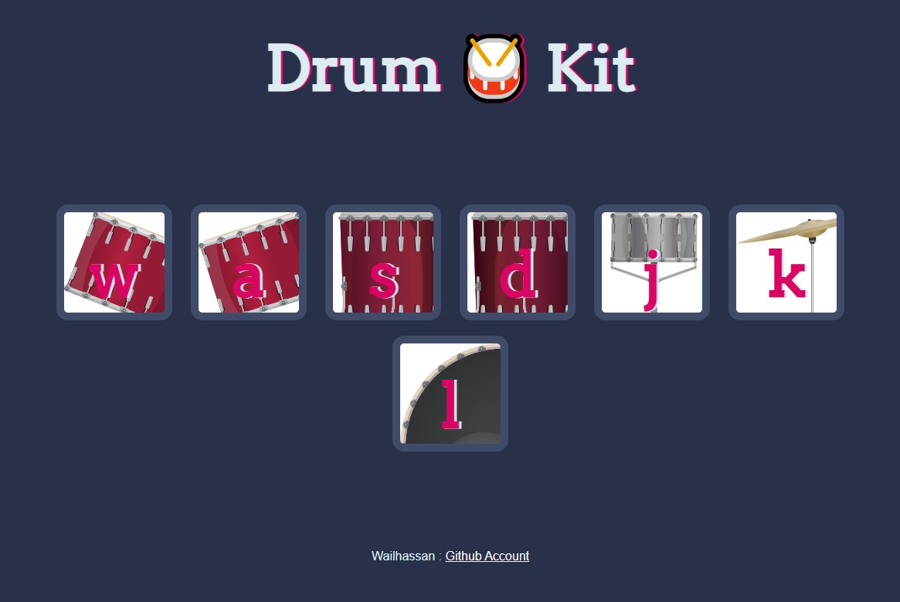

# 🥁 Drum Kit

An interactive drum kit application that allows you to play drums using your keyboard or by clicking on the drum elements. This project demonstrates the use of JavaScript event handling, DOM manipulation, and audio playback.



## Features

- Play drum sounds using keyboard keys
- Click-to-play drum elements
- Visual feedback on drum hits
- Multiple drum sounds including:
  - Crash cymbal
  - Kick bass
  - Snare drum
  - Various toms

## How to Use

1. Open `index.html` in your web browser
2. Use your keyboard to press the corresponding keys shown on the drums
3. Alternatively, click on the drum elements to play sounds
4. Enjoy making your beats! 🎵

## Technologies Used

- HTML5
- CSS3
- JavaScript (ES6+)

## Project Structure

```
├── index.html
├── styles.css
├── index.js
├── images/
└── sounds/
```

## Author

Created by [WailHassan](https://github.com/wailhassan)
